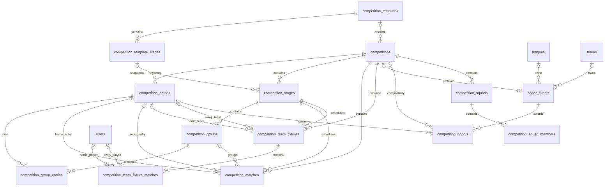

# Competition 数据库结构与流程设置说明

> 更新时间：2026-07-17  
> 适用项目：`soccer_php`  
> 本文档以当前迁移、模型和比赛模板校验规则为准。拳皇赛保留现有数据表，但暂不接入比赛模板流程。

## 1. 设计概览

比赛系统分为两层：

1. **模板层**：定义比赛适用范围、比赛类型、阶段顺序和每个阶段的规则。
2. **比赛实例层**：创建比赛时复制模板名称、阶段和规则，后续修改模板不会影响已经创建的比赛。

主要数据关系：



## 2. 通用字段约定

除特别说明外：

| 字段 | 类型 | 说明 |
| --- | --- | --- |
| `id` | `BIGINT UNSIGNED` | 主键，自增 |
| `created_at` | `TIMESTAMP NULL` | 创建时间 |
| `updated_at` | `TIMESTAMP NULL` | 更新时间 |
| `deleted_at` | `TIMESTAMP NULL` | 软删除时间，仅模板和比赛主表使用 |

外键删除规则：

- `CASCADE`：父记录删除时同步删除子记录。
- `SET NULL`：保留历史记录，只清空已经失效的关联 ID。

## 3. 表结构

### 3.1 `competition_templates` 比赛模板

定义可重复使用的比赛流程。模板不保存具体联盟、战队、报名人员或比赛时间。

| 字段 | 类型 | 可空 | 默认值 | 说明 |
| --- | --- | --- | --- | --- |
| `id` | `BIGINT UNSIGNED` | 否 | 自增 | 模板 ID |
| `name` | `VARCHAR(160)` | 否 | - | 模板名称，如“战队 32 人小组杯赛” |
| `organizer_type` | `VARCHAR(20)` | 否 | - | 比赛级别：`league` 联盟级，`team` 战队级 |
| `type` | `VARCHAR(40)` | 否 | - | 比赛类型：`team` 团体赛，`cup` 个人杯赛，`league` 个人联赛 |
| `registration_limit` | `INT UNSIGNED` | 是 | `NULL` | 固定或建议报名人数；为空表示模板不限制人数 |
| `is_fixed_participants` | `BOOLEAN` | 否 | `false` | 是否要求实际报名人数等于模板人数 |
| `status` | `BOOLEAN` | 否 | `true` | `true` 启用，`false` 停用 |
| `notes` | `TEXT` | 是 | `NULL` | 模板说明 |
| `created_at` | `TIMESTAMP` | 是 | `NULL` | 创建时间 |
| `updated_at` | `TIMESTAMP` | 是 | `NULL` | 更新时间 |
| `deleted_at` | `TIMESTAMP` | 是 | `NULL` | 软删除时间 |

索引：

- 普通索引：`(organizer_type, type, status)`，用于按菜单固定级别和类型查询可用模板。

业务约束：

- 联盟级可使用：团体赛、个人杯赛、个人联赛。
- 战队级可使用：个人杯赛、个人联赛。
- `kof` 拳皇赛当前不允许创建模板。
- 已经被比赛使用的模板不能删除，只能停用。

### 3.2 `competition_template_stages` 模板阶段

按顺序定义模板的比赛流程。阶段规则保存在 `rules` JSON 中。

| 字段 | 类型 | 可空 | 默认值 | 说明 |
| --- | --- | --- | --- | --- |
| `id` | `BIGINT UNSIGNED` | 否 | 自增 | 模板阶段 ID |
| `template_id` | `BIGINT UNSIGNED` | 否 | - | 所属模板，关联 `competition_templates.id`，删除模板时级联删除 |
| `type` | `VARCHAR(40)` | 否 | - | 阶段类型，见“阶段名称映射” |
| `name` | `VARCHAR(80)` | 否 | - | 阶段显示名称，如“总赛区小组赛” |
| `sort` | `SMALLINT UNSIGNED` | 否 | `0` | 流程顺序，当前按 `10、20、30...` 保存 |
| `rules` | `JSON` | 是 | `NULL` | 当前阶段的分区、分组、晋级、对阵和计分规则 |
| `created_at` | `TIMESTAMP` | 是 | `NULL` | 创建时间 |
| `updated_at` | `TIMESTAMP` | 是 | `NULL` | 更新时间 |

约束：

- 外键：`template_id -> competition_templates.id ON DELETE CASCADE`。
- 唯一索引：`(template_id, sort)`，同一模板内不能有两个相同顺序。
- 一个模板允许设置 1 至 8 个阶段。

### 3.3 `competitions` 比赛实例

保存一届具体比赛的基本信息、模板来源、报名配置和当前状态。

| 字段 | 类型 | 可空 | 默认值 | 说明 |
| --- | --- | --- | --- | --- |
| `id` | `BIGINT UNSIGNED` | 否 | 自增 | 比赛 ID |
| `template_id` | `BIGINT UNSIGNED` | 是 | `NULL` | 来源模板；模板删除后置空 |
| `template_name` | `VARCHAR(160)` | 是 | `NULL` | 创建比赛时的模板名称快照 |
| `organizer_type` | `VARCHAR(20)` | 否 | - | 比赛级别：`league` 联盟级，`team` 战队级 |
| `league_id` | `BIGINT UNSIGNED` | 是 | `NULL` | 联盟级比赛所属联盟，关联 `leagues.id` |
| `team_id` | `BIGINT UNSIGNED` | 是 | `NULL` | 战队级比赛所属战队，关联 `teams.id` |
| `type` | `VARCHAR(40)` | 否 | - | `team` 团体赛，`cup` 个人杯赛，`league` 个人联赛，`kof` 拳皇赛 |
| `name` | `VARCHAR(160)` | 否 | - | 比赛名称 |
| `season` | `VARCHAR(80)` | 是 | `NULL` | 届次或赛季名称 |
| `format` | `VARCHAR(40)` | 否 | - | 兼容和快速查询使用的比赛模式 |
| `status` | `VARCHAR(40)` | 否 | `registration` | 比赛当前状态 |
| `registration_deadline` | `TIMESTAMP` | 是 | `NULL` | 报名截止时间 |
| `registration_limit` | `INT UNSIGNED` | 是 | `NULL` | 最大报名人数；选模板时默认取模板人数 |
| `is_fixed_participants` | `BOOLEAN` | 否 | `false` | 是否使用固定人数报名并在报名时立即分组 |
| `reserved_count` | `INT UNSIGNED` | 否 | `0` | 已原子占用的比赛报名名额 |
| `group_count` | `SMALLINT UNSIGNED` | 是 | `NULL` | 小组数量快照，来自首个小组阶段规则 |
| `knockout_size` | `TINYINT UNSIGNED` | 是 | `NULL` | 最终淘汰赛签位快照，当前支持 `8/16/32/64` |
| `starts_at` | `TIMESTAMP` | 是 | `NULL` | 计划开始时间 |
| `ended_at` | `TIMESTAMP` | 是 | `NULL` | 比赛实际结束时间 |
| `awarded_at` | `TIMESTAMP` | 是 | `NULL` | 完成颁奖时间 |
| `notes` | `TEXT` | 是 | `NULL` | 比赛补充说明 |
| `created_at` | `TIMESTAMP` | 是 | `NULL` | 创建时间 |
| `updated_at` | `TIMESTAMP` | 是 | `NULL` | 更新时间 |
| `deleted_at` | `TIMESTAMP` | 是 | `NULL` | 软删除时间 |

索引与外键：

- `template_id -> competition_templates.id ON DELETE SET NULL`。
- `league_id -> leagues.id ON DELETE CASCADE`。
- `team_id -> teams.id ON DELETE CASCADE`。
- 普通索引：`(organizer_type, type, status)`。
- 普通索引：`(league_id, type)`。
- 普通索引：`(team_id, type)`。

`format` 名称：

| 值 | 中文名称 | 生成方式 |
| --- | --- | --- |
| `group_knockout` | 小组赛加淘汰赛 | 模板含 `group` 或 `area_group` 阶段 |
| `knockout` | 直接淘汰赛 | 模板只有淘汰赛阶段 |
| `round_robin` | 循环联赛 | 模板含 `league` 阶段 |

> `format` 是实例快捷字段，真实流程以 `competition_stages` 的阶段顺序和规则快照为准。

### 3.4 `competition_entries` 比赛报名记录

统一保存个人、战队或拳皇临时组团的报名资格。

| 字段 | 类型 | 可空 | 默认值 | 说明 |
| --- | --- | --- | --- | --- |
| `id` | `BIGINT UNSIGNED` | 否 | 自增 | 报名记录 ID，后续对阵统一引用该 ID |
| `competition_id` | `BIGINT UNSIGNED` | 否 | - | 所属比赛，删除比赛时级联删除 |
| `entry_type` | `VARCHAR(20)` | 否 | - | `user` 用户，`team` 战队，`squad` 拳皇临时组团 |
| `user_id` | `BIGINT UNSIGNED` | 是 | `NULL` | 个人赛报名用户 |
| `team_id` | `BIGINT UNSIGNED` | 是 | `NULL` | 团体赛报名战队 |
| `squad_id` | `BIGINT UNSIGNED` | 是 | `NULL` | 拳皇赛临时组团 |
| `seed` | `INT UNSIGNED` | 是 | `NULL` | 抽签、排序或编排使用的种子顺位 |
| `status` | `VARCHAR(20)` | 否 | `registered` | 报名状态；当前已实现值只有 `registered` 已报名 |
| `created_at` | `TIMESTAMP` | 是 | `NULL` | 报名时间 |
| `updated_at` | `TIMESTAMP` | 是 | `NULL` | 更新时间 |

约束：

- 唯一索引：`(competition_id, user_id)`，用户不能重复报名同一比赛。
- 唯一索引：`(competition_id, team_id)`，战队不能重复报名同一比赛。
- 唯一索引：`(competition_id, squad_id)`，组团不能重复报名同一比赛。
- 普通索引：`(competition_id, status)`。
- 一条报名记录只能按 `entry_type` 使用 `user_id`、`team_id`、`squad_id` 中对应的一项。

### 3.5 `competition_stages` 比赛阶段实例

创建比赛时从模板阶段复制。即使模板以后改名、改规则或删除阶段，比赛实例仍保留原流程。

| 字段 | 类型 | 可空 | 默认值 | 说明 |
| --- | --- | --- | --- | --- |
| `id` | `BIGINT UNSIGNED` | 否 | 自增 | 比赛阶段 ID |
| `template_stage_id` | `BIGINT UNSIGNED` | 是 | `NULL` | 来源模板阶段；模板阶段删除后置空 |
| `competition_id` | `BIGINT UNSIGNED` | 否 | - | 所属比赛，删除比赛时级联删除 |
| `type` | `VARCHAR(30)` | 否 | - | 阶段类型 |
| `name` | `VARCHAR(80)` | 否 | - | 阶段显示名称快照 |
| `sort` | `SMALLINT UNSIGNED` | 否 | `0` | 执行和展示顺序 |
| `status` | `VARCHAR(20)` | 否 | `pending` | 阶段状态 |
| `rules` | `JSON` | 是 | `NULL` | 创建比赛时复制的阶段规则快照 |
| `created_at` | `TIMESTAMP` | 是 | `NULL` | 创建时间 |
| `updated_at` | `TIMESTAMP` | 是 | `NULL` | 更新时间 |

索引与外键：

- `competition_id -> competitions.id ON DELETE CASCADE`。
- `template_stage_id -> competition_template_stages.id ON DELETE SET NULL`。
- 普通索引：`competition_id`。
- 普通索引：`(competition_id, type)`。
- 同一比赛允许出现多个同类型阶段，以支持更复杂的顺序流程。

阶段状态：

| 值 | 中文名称 |
| --- | --- |
| `pending` | 待开始 |
| `in_progress` | 进行中 |
| `completed` | 已结束 |

### 3.6 `competition_groups` 比赛小组

保存某个小组赛阶段的实际小组容器。

| 字段 | 类型 | 可空 | 默认值 | 说明 |
| --- | --- | --- | --- | --- |
| `id` | `BIGINT UNSIGNED` | 否 | 自增 | 小组 ID |
| `stage_id` | `BIGINT UNSIGNED` | 否 | - | 所属比赛阶段，删除阶段时级联删除 |
| `name` | `VARCHAR(40)` | 否 | - | 小组名称，如 `A组`、`B组` |
| `sort` | `SMALLINT UNSIGNED` | 否 | `0` | 小组展示顺序 |
| `capacity` | `SMALLINT UNSIGNED` | 是 | `NULL` | 小组总名额；非固定分组前可为空 |
| `reserved_count` | `SMALLINT UNSIGNED` | 否 | `0` | 小组已原子占用名额 |
| `created_at` | `TIMESTAMP` | 是 | `NULL` | 创建时间 |
| `updated_at` | `TIMESTAMP` | 是 | `NULL` | 更新时间 |

约束：唯一索引 `(stage_id, name)`，同一阶段内小组名称不能重复。

### 3.7 `competition_group_entries` 小组成员关联

保存报名对象被分配到哪个小组。

| 字段 | 类型 | 可空 | 默认值 | 说明 |
| --- | --- | --- | --- | --- |
| `id` | `BIGINT UNSIGNED` | 否 | 自增 | 关联记录 ID |
| `group_id` | `BIGINT UNSIGNED` | 否 | - | 小组 ID，关联 `competition_groups.id` |
| `entry_id` | `BIGINT UNSIGNED` | 否 | - | 报名记录 ID，关联 `competition_entries.id` |
| `created_at` | `TIMESTAMP` | 是 | `NULL` | 分组时间 |
| `updated_at` | `TIMESTAMP` | 是 | `NULL` | 更新时间 |

约束：唯一索引 `(group_id, entry_id)`，同一报名对象不能重复进入同一小组。

### 3.8 `competition_matches` 比赛对阵与比分

小组赛、循环赛和淘汰赛共用一张对阵表。

| 字段 | 类型 | 可空 | 默认值 | 说明 |
| --- | --- | --- | --- | --- |
| `id` | `BIGINT UNSIGNED` | 否 | 自增 | 对阵 ID |
| `competition_id` | `BIGINT UNSIGNED` | 否 | - | 所属比赛 |
| `stage_id` | `BIGINT UNSIGNED` | 否 | - | 所属阶段 |
| `group_id` | `BIGINT UNSIGNED` | 是 | `NULL` | 所属小组；淘汰赛通常为空 |
| `home_entry_id` | `BIGINT UNSIGNED` | 是 | `NULL` | 主队或主选手报名记录；待定或轮空时可为空 |
| `away_entry_id` | `BIGINT UNSIGNED` | 是 | `NULL` | 客队或客选手报名记录；待定或轮空时可为空 |
| `winner_entry_id` | `BIGINT UNSIGNED` | 是 | `NULL` | 比分确认后的胜者；小组赛平局可为空 |
| `round_label` | `VARCHAR(80)` | 是 | `NULL` | 轮次名称，如“小组 A”“十六强”“半决赛” |
| `round_number` | `SMALLINT UNSIGNED` | 是 | `NULL` | 当前阶段内的轮次编号 |
| `sequence` | `SMALLINT UNSIGNED` | 否 | `0` | 同一轮中的场次顺序 |
| `home_score` | `SMALLINT UNSIGNED` | 是 | `NULL` | 主队或主选手得分 |
| `away_score` | `SMALLINT UNSIGNED` | 是 | `NULL` | 客队或客选手得分 |
| `tie_break_type` | `VARCHAR(30)` | 是 | `NULL` | 平局决胜方式，当前支持 `away_goals` 客场进球 |
| `status` | `VARCHAR(20)` | 否 | `pending` | `pending` 未报分，`reported` 待确认，`completed` 已完成 |
| `reported_by_user_id` | `BIGINT UNSIGNED` | 是 | `NULL` | 报分用户 |
| `reported_at` | `TIMESTAMP` | 是 | `NULL` | 报分时间 |
| `reviewed_by_user_id` | `BIGINT UNSIGNED` | 是 | `NULL` | 确认或驳回比分的用户 |
| `reviewed_at` | `TIMESTAMP` | 是 | `NULL` | 比分审核时间 |
| `review_note` | `VARCHAR(500)` | 是 | `NULL` | 比分确认或驳回说明 |
| `scheduled_at` | `TIMESTAMP` | 是 | `NULL` | 计划比赛时间 |
| `created_at` | `TIMESTAMP` | 是 | `NULL` | 创建时间 |
| `updated_at` | `TIMESTAMP` | 是 | `NULL` | 更新时间 |

索引与删除规则：

- `competition_id`、`stage_id` 删除时级联删除对阵。
- `group_id`、`home_entry_id`、`away_entry_id` 的来源删除后置空。
- `winner_entry_id`、报分用户和审核用户删除后置空。
- 普通索引：`(competition_id, status)`。
- 普通索引：`(stage_id, round_number, sequence)`。

### 3.9 `competition_team_fixtures` 团体赛战队对阵

团体赛使用独立的战队对阵聚合表。每条记录表示一场战队对战，战队比分由其队员场次胜负自动汇总，不与个人杯赛的 `competition_matches` 混用。

| 字段 | 类型 | 可空 | 默认值 | 说明 |
| --- | --- | --- | --- | --- |
| `id` | `BIGINT UNSIGNED` | 否 | 自增 | 团体对阵 ID |
| `competition_id` | `BIGINT UNSIGNED` | 否 | - | 所属团体赛，删除比赛时级联删除 |
| `stage_id` | `BIGINT UNSIGNED` | 否 | - | 所属循环赛或淘汰赛阶段 |
| `home_entry_id` | `BIGINT UNSIGNED` | 是 | `NULL` | 主队报名记录，待定签位可为空 |
| `away_entry_id` | `BIGINT UNSIGNED` | 是 | `NULL` | 客队报名记录，待定签位可为空 |
| `winner_entry_id` | `BIGINT UNSIGNED` | 是 | `NULL` | 完赛后的胜者报名记录；循环赛平局可为空 |
| `round_label` | `VARCHAR(80)` | 是 | `NULL` | 轮次名称，如“循环赛第 1 轮”“半决赛” |
| `round_number` | `SMALLINT UNSIGNED` | 否 | - | 当前阶段内轮次编号 |
| `sequence` | `SMALLINT UNSIGNED` | 否 | - | 当前阶段内对阵顺序 |
| `leg_number` | `TINYINT UNSIGNED` | 否 | `1` | 主客回合：`1` 首回合，`2` 次回合 |
| `home_score` | `SMALLINT UNSIGNED` | 是 | `NULL` | 主队获胜的队员场次数 |
| `away_score` | `SMALLINT UNSIGNED` | 是 | `NULL` | 客队获胜的队员场次数 |
| `status` | `VARCHAR(20)` | 否 | `pending` | `pending` 未完赛，`completed` 已完赛 |
| `scheduled_at` | `TIMESTAMP` | 是 | `NULL` | 分配后的团体对阵日期时间 |
| `reported_by_user_id` | `BIGINT UNSIGNED` | 是 | `NULL` | 提交团体比分的用户 |
| `reported_at` | `TIMESTAMP` | 是 | `NULL` | 团体比分提交时间 |
| `created_at` | `TIMESTAMP` | 是 | `NULL` | 创建时间 |
| `updated_at` | `TIMESTAMP` | 是 | `NULL` | 更新时间 |

索引与约束：

- 唯一索引：`(stage_id, sequence)`，阶段内对阵顺序不能重复。
- 普通索引：`(competition_id, status)`、`(stage_id, round_number, leg_number)`、`(scheduled_at, status)`。
- 比赛、阶段删除时级联删除对阵；报名记录或报分用户删除后对应外键置空。
- 循环赛首、次回合分别保存为两条对阵，主客队互换。

### 3.10 `competition_team_fixture_matches` 团体赛队员场次

保存某场战队对阵下可变数量的队员比分。页面默认提供 9 场，可按实际参赛人数增加或删除；提交时一次性保存并计算战队比分。

| 字段 | 类型 | 可空 | 默认值 | 说明 |
| --- | --- | --- | --- | --- |
| `id` | `BIGINT UNSIGNED` | 否 | 自增 | 队员场次 ID |
| `fixture_id` | `BIGINT UNSIGNED` | 否 | - | 所属团体对阵，删除对阵时级联删除 |
| `sequence` | `SMALLINT UNSIGNED` | 否 | - | 团体对阵内的队员场次顺序 |
| `home_user_id` | `BIGINT UNSIGNED` | 是 | `NULL` | 主队队员用户 ID，用户删除后置空 |
| `away_user_id` | `BIGINT UNSIGNED` | 是 | `NULL` | 客队队员用户 ID，用户删除后置空 |
| `home_player_name` | `VARCHAR(160)` | 否 | - | 主队队员名称快照 |
| `away_player_name` | `VARCHAR(160)` | 否 | - | 客队队员名称快照 |
| `home_score` | `SMALLINT UNSIGNED` | 否 | - | 主队队员本场比分 |
| `away_score` | `SMALLINT UNSIGNED` | 否 | - | 客队队员本场比分 |
| `created_at` | `TIMESTAMP` | 是 | `NULL` | 创建时间 |
| `updated_at` | `TIMESTAMP` | 是 | `NULL` | 更新时间 |

约束：

- 唯一索引：`(fixture_id, sequence)`。
- 普通索引：`(fixture_id, home_user_id)`、`(fixture_id, away_user_id)`。
- 同一团体对阵内，主队和客队各自不能重复选择同一名队员。
- 队员单场比分不允许平局；主队队员获胜数写入团体对阵 `home_score`，客队同理。

### 3.11 `honor_events` 荣誉档案

一条记录代表一届赛事的完整荣誉档案。正常比赛颁奖和上线前历史录入共用该表。

| 字段 | 类型 | 可空 | 默认值 | 说明 |
| --- | --- | --- | --- | --- |
| `id` | `BIGINT UNSIGNED` | 否 | 自增 | 荣誉档案 ID |
| `competition_id` | `BIGINT UNSIGNED` | 是 | `NULL` | 正常比赛来源；历史录入不需要关联比赛 |
| `source` | `VARCHAR(20)` | 否 | `manual` | `competition` 比赛颁奖，`manual` 历史录入 |
| `organizer_type` | `VARCHAR(20)` | 否 | - | `league` 联盟荣誉，`team` 战队荣誉 |
| `league_id` | `BIGINT UNSIGNED` | 是 | `NULL` | 联盟荣誉所属联盟 |
| `team_id` | `BIGINT UNSIGNED` | 是 | `NULL` | 战队荣誉所属战队 |
| `competition_type` | `VARCHAR(40)` | 否 | - | `team/cup/league/kof` |
| `competition_name` | `VARCHAR(160)` | 否 | - | 赛事名称快照 |
| `season` | `VARCHAR(80)` | 是 | `NULL` | 届次或赛季名称 |
| `ended_at` | `TIMESTAMP` | 是 | `NULL` | 历史赛事结束时间 |
| `notes` | `TEXT` | 是 | `NULL` | 历史录入说明 |
| `created_at` | `TIMESTAMP` | 是 | `NULL` | 创建时间 |
| `updated_at` | `TIMESTAMP` | 是 | `NULL` | 更新时间 |

约束：

- `competition_id` 唯一；同一场正常比赛只生成一份荣誉档案。
- 联盟荣誉填写 `league_id`，战队荣誉填写 `team_id`。
- 普通索引：`(organizer_type, competition_type, ended_at)`。
- 删除关联比赛时自动删除比赛来源档案；联盟或战队存在荣誉时不允许删除。

### 3.12 `competition_honors` 荣誉奖项明细

保存比赛最终名次，并保存获奖名称快照供荣誉室长期展示。

| 字段 | 类型 | 可空 | 默认值 | 说明 |
| --- | --- | --- | --- | --- |
| `id` | `BIGINT UNSIGNED` | 否 | 自增 | 荣誉 ID |
| `honor_event_id` | `BIGINT UNSIGNED` | 是 | `NULL` | 所属荣誉档案；新数据必须填写 |
| `competition_id` | `BIGINT UNSIGNED` | 是 | `NULL` | 正常比赛兼容关联；历史录入为空 |
| `entry_id` | `BIGINT UNSIGNED` | 是 | `NULL` | 获奖报名对象；报名记录删除后置空 |
| `rank` | `TINYINT UNSIGNED` | 否 | - | `1` 冠军，`2` 亚军，`3` 季军，`4` 殿军 |
| `title` | `VARCHAR(20)` | 否 | - | 中文奖项名称 |
| `owner_name` | `VARCHAR(160)` | 否 | - | 获奖对象名称快照，避免用户或战队改名影响历史 |
| `created_at` | `TIMESTAMP` | 是 | `NULL` | 创建时间 |
| `updated_at` | `TIMESTAMP` | 是 | `NULL` | 更新时间 |

约束：

- 唯一索引：`(competition_id, rank)`，同一比赛每个名次只有一条记录。
- 唯一索引：`(honor_event_id, rank)`，同一荣誉档案每个名次只有一条记录。
- 普通索引：`(rank, created_at)`，供荣誉室按名次和时间查询。

### 3.13 `competition_squads` 拳皇临时组团

> 拳皇比赛方向与普通杯赛不同，当前保留表结构，暂不纳入模板流程。

| 字段 | 类型 | 可空 | 默认值 | 说明 |
| --- | --- | --- | --- | --- |
| `id` | `BIGINT UNSIGNED` | 否 | 自增 | 临时组团 ID |
| `competition_id` | `BIGINT UNSIGNED` | 否 | - | 所属拳皇比赛，删除比赛时级联删除 |
| `name` | `VARCHAR(120)` | 否 | - | 临时组团名称 |
| `created_at` | `TIMESTAMP` | 是 | `NULL` | 创建时间 |
| `updated_at` | `TIMESTAMP` | 是 | `NULL` | 更新时间 |

约束：唯一索引 `(competition_id, name)`。

### 3.14 `competition_squad_members` 拳皇组团成员

| 字段 | 类型 | 可空 | 默认值 | 说明 |
| --- | --- | --- | --- | --- |
| `id` | `BIGINT UNSIGNED` | 否 | 自增 | 关联记录 ID |
| `squad_id` | `BIGINT UNSIGNED` | 否 | - | 临时组团 ID，删除组团时级联删除 |
| `user_id` | `BIGINT UNSIGNED` | 否 | - | 组团成员用户 ID，删除用户时级联删除 |
| `created_at` | `TIMESTAMP` | 是 | `NULL` | 加入时间 |
| `updated_at` | `TIMESTAMP` | 是 | `NULL` | 更新时间 |

约束：唯一索引 `(squad_id, user_id)`。

## 4. 流程设置名称与存储值

### 4.1 比赛级别

前端字段名称：**比赛级别**  
存储位置：`competition_templates.organizer_type`、`competitions.organizer_type`

| 存储值 | 中文名称 | 组织字段 |
| --- | --- | --- |
| `league` | 联盟级 | 使用 `league_id` |
| `team` | 战队级 | 使用 `team_id` |

### 4.2 比赛类型

前端字段名称：**比赛类型**  
存储位置：`competition_templates.type`、`competitions.type`

| 比赛级别 | 存储值 | 菜单或业务名称 |
| --- | --- | --- |
| 联盟级 | `team` | 团体赛 |
| 联盟级 | `cup` | 联盟个人杯赛 |
| 联盟级 | `league` | 联盟个人联赛 |
| 战队级 | `cup` | 战队个人杯赛、今日之星 |
| 战队级 | `league` | 战队个人联赛 |
| 战队级 | `kof` | 战队拳皇赛，暂不使用模板 |

说明：

- “今日之星”当前不是独立 `type`，而是战队级个人杯赛模板名称。
- 固定菜单决定比赛级别和比赛类型，用户只选择该菜单下可用的模板。

### 4.3 比赛阶段

前端字段名称：**比赛阶段**  
存储位置：`competition_template_stages.type`、`competition_stages.type`

| 存储值 | 设置名称 | 用途 |
| --- | --- | --- |
| `area_group` | 分区小组赛 | 先分赛区，再在各赛区进行小组赛 |
| `area_knockout` | 分区淘汰赛 | 各赛区分别生成淘汰签表 |
| `group` | 总赛区小组赛 | 不分赛区，直接进行小组赛 |
| `knockout` | 总赛区淘汰赛 | 总决赛区淘汰阶段或直接淘汰赛 |
| `league` | 循环联赛 | 个人联赛或纯循环赛阶段 |

`name` 是可编辑显示名称。推荐名称：

- `area_group`：分区小组赛
- `area_knockout`：分区淘汰赛
- `group`：总赛区小组赛；团体赛可显示为“团体循环赛”
- `knockout`：总赛区淘汰赛；团体赛可显示为“团体淘汰赛”
- `league`：个人循环联赛

### 4.4 阶段规则 `rules`

前端的流程设置保存在模板阶段 `rules`，创建比赛后复制到比赛阶段 `rules`。

| JSON 字段 | 前端设置名称 | 类型/可选值 | 说明 |
| --- | --- | --- | --- |
| `area_count` | 分区数量 | `2-32` | `area_group`、`area_knockout` 必填 |
| `group_count` | 小组数量 | `1-64` | `group`、`area_group` 必填 |
| `qualify_count` | 晋级名额 | `2-256` | 当前阶段晋级到下一阶段的总人数 |
| `knockout_size` | 淘汰赛签位 | `2/4/8/16/32/64/128/256` | 淘汰赛对阵图的标准签位数 |
| `pairing_mode` | 对阵方式 | 见下表 | 决定淘汰赛首轮如何安排 |
| `scoring_mode` | 计分方式 | 见下表 | 决定单场或主客场如何报分和积分 |
| `team_assignment` | 球队分配 | 见下表 | 固定球队模板中的球队分配方式 |
| `avoid_same_source` | 首轮同组/同区回避 | `true/false` | 随机对阵时避免同组或同区首轮相遇 |
| `schedule_start_date` | 团体循环赛开始日期 | `YYYY-MM-DD` | 开启团体循环赛时写入比赛阶段规则快照 |
| `schedule_end_date` | 团体循环赛结束日期 | `YYYY-MM-DD` | 开启团体循环赛时写入比赛阶段规则快照 |
| `include_weekends` | 是否包含双休日 | `true/false` | `false` 只在周一至周五排期，`true` 包含周六、周日 |

对阵方式：

| 存储值 | 中文名称 | 规则含义 |
| --- | --- | --- |
| `cross` | 交叉对阵 | 如 `A1-B2`、`B1-A2`，或一区第一对二区第四 |
| `random` | 随机分配 | 随机生成对阵，可结合首轮同组/同区回避 |
| `ranking` | 按排名对阵 | 如团体赛 `1-8、2-7、3-6、4-5` |

团体赛开启淘汰赛时还支持运行时选择 `custom` 指定对阵。`custom` 不保存为通用模板规则，管理员需要逐场选择主客战队，可同时设置比赛时间。

计分方式：

| 存储值 | 中文名称 | 规则含义 |
| --- | --- | --- |
| `single` | 单场报分 | 一场比赛直接决定比分或胜负 |
| `home_away_combined` | 主客合并报分 | 一次提交两回合合计结果 |
| `home_away_points` | 主客分开积分 | 主场、客场分别生成比赛并分别计入积分 |

球队分配：

| 存储值 | 中文名称 | 规则含义 |
| --- | --- | --- |
| `none` | 不使用固定球队 | 参赛对象不绑定模板球队 |
| `random` | 随机球队 | 报名结束后随机分配国家队或俱乐部 |
| `preassigned` | 预设小组球队 | 模板先配置各小组球队，报名人员随机进入球队位置 |

> `rules.knockout_size` 当前允许配置到 `256`，但现有比赛实例字段和签表执行器只完整支持 `8/16/32/64`。`128/256` 属于预留配置，正式启用前需要先完成第 7.9 节的结构调整。

32 人小组杯赛规则示例：

```json
[
  {
    "type": "group",
    "name": "总赛区小组赛",
    "rules": {
      "group_count": 8,
      "qualify_count": 16,
      "scoring_mode": "single",
      "team_assignment": "none"
    }
  },
  {
    "type": "knockout",
    "name": "总赛区淘汰赛",
    "rules": {
      "knockout_size": 16,
      "pairing_mode": "cross",
      "scoring_mode": "single",
      "avoid_same_source": true
    }
  }
]
```

### 4.5 比赛状态

存储位置：`competitions.status`

| 存储值 | 后台显示名称 | 含义 |
| --- | --- | --- |
| `registration` | 报名中 | 允许符合条件的用户或战队报名 |
| `in_progress` | 正在进行 | 报名已结束，第一阶段进行中 |
| `knockout` | 小组赛结束 / 淘汰赛开始 | 小组赛锁定，淘汰赛进行中 |
| `awaiting_awards` | 淘汰赛结束 / 待颁奖 | 比赛结果已确定，等待确认奖项 |
| `completed` | 已结束 | 已颁奖并锁定比赛数据 |

推荐状态流转：

```text
报名中 registration
  -> 正在进行 in_progress
  -> 淘汰赛 knockout（无淘汰阶段时可跳过）
  -> 待颁奖 awaiting_awards
  -> 已结束 completed
```

管理员恢复状态时只允许逐级回退，不应直接跨阶段修改。

## 5. 业务流程与模板名称

### 5.1 8/16 人今日之星

模板名称：

- 战队 8 人今日之星
- 战队 16 人今日之星

流程：

```text
报名 -> 结束报名并随机抽签 -> 总赛区淘汰赛 -> 待颁奖 -> 已结束
```

特点：只有一个 `knockout` 阶段，没有小组赛。

### 5.2 32 人个人杯赛

模板名称：

- 战队 32 人小组杯赛
- 联盟 32 人个人杯赛

流程：

```text
报名
  -> 随机分配 8 个小组
  -> 总赛区小组赛
  -> 选出 16 人
  -> 交叉或随机生成总赛区淘汰赛
  -> 待颁奖
  -> 已结束
```

这是个人杯赛第一套建议完整跑通的模板。

### 5.3 分区个人杯赛

可配置流程：

```text
报名
  -> 设置赛区名称和人数
  -> 分区小组赛或分区淘汰赛
  -> 每区产生固定晋级名额
  -> 总赛区淘汰赛
  -> 待颁奖
  -> 已结束
```

对应阶段类型：

- 第一阶段：`area_group` 或 `area_knockout`
- 第二阶段：`knockout`

### 5.4 联盟团体赛

模板名称：联盟团体循环加淘汰赛

流程：

```text
战队报名
  -> 开启团体循环赛，选择日期范围和是否包含双休日
  -> 生成主客双循环战队对阵和比赛日期
  -> 每场团体对阵录入可变数量的队员比分
  -> 按队员胜场计算战队比分和循环赛积分榜
  -> 选择晋级名额和交叉、随机或指定对阵
  -> 团体淘汰赛逐轮报分并自动生成下一轮参赛战队
  -> 冠亚季殿军颁奖
  -> 已结束
```

当前模板阶段：

- `group`，显示名称“团体循环赛”
- `knockout`，显示名称“团体淘汰赛”

双循环排期约束：

1. 每两支报名战队生成两场对阵，首回合和次回合互换主客。
2. 可用比赛日由开始日期、结束日期和“是否包含双休日”计算。
3. 日期范围按日历中点拆分，首回合排在前半段，次回合排在后半段。
4. 各轮比赛在各自半程的可用比赛日中均匀展开。
5. 同一支战队同一天最多参加一场团体对阵。
6. 首回合主场分配按轮换算法平衡，单队主场次数差最多一场；次回合反转主客后全程主客次数相同。

团体报分规则：

1. 每场战队对阵默认展示 9 场队员比赛，也允许增加或删除。
2. 每场选择主队、客队各一名队员并填写个人比分，同一侧队员不得重复使用。
3. 队员比分不能平局；主队队员胜一场，团体主队比分加一，客队同理。
4. 提交后同时保存队员场次、战队总比分、胜者和报分信息，对阵状态改为 `completed`。
5. 循环赛按胜 3 分、平 1 分、负 0 分排序，再比较战队净胜场和总胜场。

团体淘汰赛规则：

- `cross`：按循环赛排名首尾交叉，如 `1-8、2-7、3-6、4-5`。
- `random`：从晋级战队中随机生成首轮对阵。
- `custom`：管理员指定每场主客战队和可选比赛时间。
- 一轮团体对阵完赛后，胜者自动写入下一轮对应签位；决赛完成后进入待颁奖，由管理员确认冠亚季殿军。

### 5.5 个人循环联赛

模板名称：

- 联盟个人循环联赛
- 战队个人循环联赛

流程：

```text
报名 -> 生成个人循环赛程 -> 完成全部轮次 -> 排名确认 -> 已结束
```

阶段类型：`league`。

### 5.6 固定球队杯赛

建议在个人杯赛模板中设置：

```json
{
  "team_assignment": "random"
}
```

或：

```json
{
  "team_assignment": "preassigned"
}
```

流程：

```text
模板配置国家队/俱乐部
  -> 报名
  -> 随机分配球队或进入预设球队位置
  -> 小组赛
  -> 淘汰赛
  -> 颁奖
```

### 5.7 拳皇赛

存储类型：`competitions.type = kof`。

拳皇赛使用 `competition_squads` 和 `competition_squad_members` 表示临时组团。由于赛制方向不同，当前不允许创建拳皇比赛模板，后续单独设计流程。

## 6. 当前已经实现的结构能力

- 比赛模板和模板阶段 CRUD。
- 模板阶段顺序和规则 JSON 校验。
- 按比赛级别、比赛类型筛选可用模板。
- 按模板创建比赛。
- 模板名称、阶段名称和阶段规则的实例快照。
- 小组赛模板创建时生成 A组、B组等小组容器。
- 固定人数报名使用 `reserved_count < registration_limit` 原子占位，并立即随机占用小组名额。
- 非固定人数比赛在结束报名、开启小组赛时统一随机分组。
- 32 人战队杯赛生成 8 组、48 场小组赛和 15 场淘汰赛。
- 比分按 `pending -> reported -> completed` 流转，由对手或赛事管理确认。
- 小组赛按积分、净胜球、进球数计算排名，并按交叉规则生成 16 强。
- 淘汰赛确认比分后自动把胜者写入下一轮，决赛确认后进入待颁奖。
- 平局可记录 `away_goals` 并指定晋级选手。
- 决赛和半决赛结果自动带出冠亚季殿军候选并完成颁奖。
- 个人和团体报名记录。
- 联盟团体赛按日期范围和工作日设置生成主客双循环赛程。
- 团体循环赛保证同队同日不重复比赛，并将首、次回合分布在日期范围前后半程。
- 团体赛使用独立战队对阵和队员比分表，支持默认 9 场及可变队员场次数。
- 团体比分按队员胜场自动汇总，并实时生成战队积分榜。
- 团体淘汰赛支持交叉、随机、后台指定三种对阵，支持逐轮自动晋级和冠亚季殿军颁奖。
- 联盟前台团体赛总览使用真实战队对阵和队员比分聚合战队积分榜、个人成绩榜，并从荣誉档案读取历届赛事。

分区阶段、固定球队、个人赛复杂主客场规则和 `128/256` 人签表目前只完成模板配置结构，尚未完成对应执行逻辑。

## 7. 后续流程需要补充的数据结构

以下需求已经进入产品流程，但当前表结构还没有完整表达。实现对应功能前应先补迁移，避免把复杂状态继续塞进现有字段。

### 7.1 报名资格取消与恢复

当前 `competition_entries.status` 只有 `registered`。建议增加：

| 建议值 | 名称 |
| --- | --- |
| `registered` | 已报名 |
| `cancelled` | 已取消资格 |
| `withdrawn` | 主动退赛 |

同时建议增加 `status_reason`、`status_changed_at`、`status_changed_by`。

### 7.2 分区实体

当前只有 `rules.area_count`，没有保存赛区名称、人数和参赛者分配结果的表。建议新增：

- `competition_areas`
- `competition_area_entries`

至少包含赛区名称、顺序、人数限制和所属阶段。

### 7.3 主客场和两回合比赛

当前 `competition_matches` 没有以下字段：

- 主客回合编号 `leg_number`
- 两回合对阵标识 `tie_id`
- 总比分
- 客场进球数
- 下一场位置 `next_match_id`、`next_slot`

当前已经通过 `winner_entry_id` 和轮次位置计算实现自动晋级，也能人工选择 `away_goals` 晋级者；实现真正的两回合主客合并计算前仍需补齐上述回合和总比分字段。

### 7.4 淘汰赛人工替补

需要保存原参赛者、替换参赛者、替换原因、操作管理员和操作时间。建议新增独立调整日志表，不能只覆盖 `home_entry_id` 或 `away_entry_id`。

### 7.5 固定球队目录与分配

当前只有 `team_assignment` 配置值，还没有国家队/俱乐部目录及实际分配结果。建议新增：

- 固定球队目录表
- 模板阶段球队位置表
- 比赛报名对象球队分配表

这里的“球队”是游戏内国家队或俱乐部，不应复用系统的 `teams` 战队表。

### 7.6 团体赛排期

团体赛基础排期已经实现：日期范围和双休日配置保存到阶段 `rules`，首/次回合、具体日期和状态保存到 `competition_team_fixtures`。当前采用全时间范围均匀排期，不提供“每周固定几场”人工覆盖。

后续如需处理节假日、禁赛日、场地冲突或手动改期，建议新增排期例外和改期日志，不应直接覆盖历史 `scheduled_at` 而不留记录。

### 7.7 MVP、FMVP 和可扩展奖项

当前荣誉档案层已经独立，但 `competition_honors.rank` 仍只适合冠军至殿军。MVP、FMVP 不属于排名，后续应在奖项明细增加 `award_type`：

```text
award_type: champion / runner_up / third / fourth / mvp / fmvp
```

### 7.8 状态回退与操作审计

当前没有比赛状态操作日志。管理员恢复待颁奖状态、重新颁奖或调整晋级人员前，建议新增 `competition_operation_logs`，记录：

- 比赛 ID
- 操作类型
- 原状态、新状态
- 操作前数据、操作后数据
- 操作用户
- 操作原因
- 操作时间

### 7.9 大型淘汰签表字段

`competition_template_stages.rules.knockout_size` 允许配置 `128/256`，但 `competitions.knockout_size` 当前是 `TINYINT UNSIGNED`，最大只能保存 `255`，无法保存 `256`；现有签表生成器也只接受 `8/16/32/64`。

正式支持大型签表前需要：

- 将 `competitions.knockout_size` 改为 `SMALLINT UNSIGNED`。
- 将比赛保存校验与签表生成器统一扩展到 `2/4/8/16/32/64/128/256`。
- 补充大人数轮空、分区晋级和性能测试。

## 8. 开发约束

1. 模板只定义流程，不保存具体比赛产生的数据。
2. 比赛创建后必须使用 `competition_stages.rules` 快照执行，不能实时读取模板规则。
3. 前端菜单固定比赛级别和比赛类型，不能通过提交参数跨级别选择模板。
4. 报名、阶段切换、报分、晋级和颁奖必须由后端状态机校验。
5. 颁奖完成后默认锁定比赛；恢复和重新颁奖只能由管理员执行并记录日志。
6. 拳皇赛不复用普通杯赛模板，后续单独设计。
